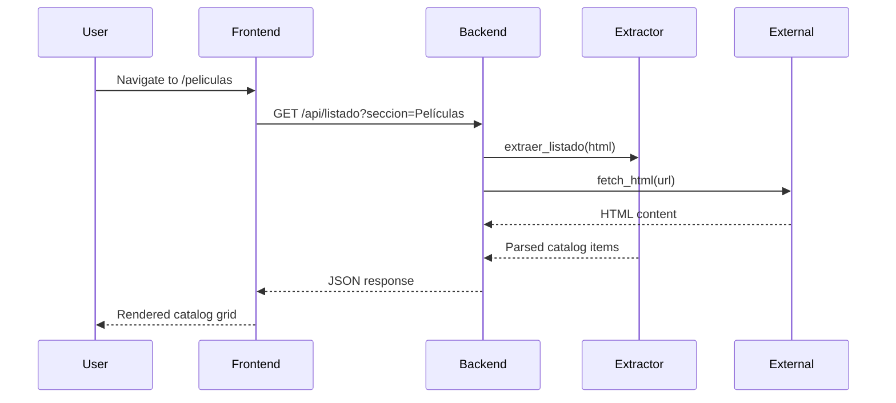

## System Architecture

Web Scraping Hub is a full-stack web application designed to provide streaming and catalog functionality for movies, series, and anime content. The system follows a client-server architecture with clear separation between frontend and backend components.

### Architecture Diagram

```
┌─────────────────────────────────────────────────────────────┐
│                        Client Layer                          │
│  ┌──────────────────────────────────────────────────────┐  │
│  │  React Frontend (Vite + TypeScript)                  │  │
│  │  - React Router for navigation                       │  │
│  │  - TanStack Query for state management               │  │
│  │  - TailwindCSS for styling                          │  │
│  └──────────────────────────────────────────────────────┘  │
└─────────────────────────────────────────────────────────────┘
                            ↕ HTTP/REST
┌─────────────────────────────────────────────────────────────┐
│                        Server Layer                          │
│  ┌──────────────────────────────────────────────────────┐  │
│  │  Flask Backend (Python)                              │  │
│  │  - RESTful API endpoints                            │  │
│  │  - CORS enabled                                      │  │
│  │  - Static file serving                              │  │
│  └──────────────────────────────────────────────────────┘  │
└─────────────────────────────────────────────────────────────┘
                            ↕
┌─────────────────────────────────────────────────────────────┐
│                      Processing Layer                        │
│  ┌──────────────────────────────────────────────────────┐  │
│  │  Extractor System                                    │  │
│  │  - Generic Extractor (listings & info)              │  │
│  │  - Series Extractor (episodes & metadata)           │  │
│  │  - IFrame Extractor (player URLs)                   │  │
│  └──────────────────────────────────────────────────────┘  │
└─────────────────────────────────────────────────────────────┘
                            ↕
┌─────────────────────────────────────────────────────────────┐
│                       External Layer                         │
│  ┌──────────────────────────────────────────────────────┐  │
│  │  HTTP Client (CloudScraper)                         │  │
│  │  - Cloudflare bypass                                │  │
│  │  - Ad blocking                                      │  │
│  │  - HTML/JSON fetching                               │  │
│  └──────────────────────────────────────────────────────┘  │
└─────────────────────────────────────────────────────────────┘
```

## Tech Stack

### Backend Technologies

<CardGroup cols={2}>
  <Card title="Flask" icon="flask">
    Python web framework for building the REST API
  </Card>
  <Card title="CloudScraper" icon="cloud">
    HTTP client with Cloudflare bypass capabilities
  </Card>
  <Card title="BeautifulSoup4" icon="code">
    HTML parsing and web scraping library
  </Card>
  <Card title="AdblockParser" icon="shield">
    Ad blocking rules for clean HTML extraction
  </Card>
</CardGroup>

### Frontend Technologies

<CardGroup cols={2}>
  <Card title="React 18" icon="react">
    Modern UI library with hooks and Suspense
  </Card>
  <Card title="TypeScript" icon="t">
    Type-safe JavaScript for better developer experience
  </Card>
  <Card title="TanStack Query" icon="database">
    Data fetching and caching solution
  </Card>
  <Card title="React Router" icon="route">
    Client-side routing with lazy loading
  </Card>
  <Card title="TailwindCSS" icon="palette">
    Utility-first CSS framework
  </Card>
  <Card title="Vite" icon="bolt">
    Fast build tool and dev server
  </Card>
</CardGroup>

## Data Flow

### Request Flow

1. **User Interaction**: User navigates to a catalog page or searches for content
2. **Frontend Request**: React component triggers API call via TanStack Query hook
3. **Backend Processing**: Flask receives request and routes to appropriate handler
4. **Data Extraction**: Extractor modules fetch and parse external content
5. **Response**: Processed data returned as JSON to frontend
6. **UI Update**: React components re-render with new data

### Example: Movie Catalog Flow



## Key Design Principles

### Separation of Concerns

The architecture maintains clear boundaries between layers:
- **Presentation Layer**: React components handle UI rendering
- **Business Logic Layer**: Flask routes and extractors process data
- **Data Access Layer**: HTTP client handles external requests

### Modularity

Each component is self-contained and can be modified independently:
- Extractors are modular and can be extended for new sources
- Frontend hooks are organized by domain (API, UI, utils)
- Backend utilities are separated by function

### Performance Optimization

- **Lazy Loading**: Frontend pages load on demand
- **Caching**: TanStack Query caches API responses (5 min stale time)
- **Image Optimization**: Lazy loading for catalog images
- **Preloading**: First catalog image preloaded for better LCP

### Error Handling

- Backend returns consistent error responses
- Frontend uses Error Boundaries for graceful degradation
- Retry logic built into TanStack Query (3 retries)

## Deployment Architecture

The application supports multiple deployment modes:

### Development Mode
- Backend runs on port 1234
- Frontend dev server on port 5173
- CORS enabled for cross-origin requests

### Production Mode
- Backend serves both API and static frontend files
- Single port (1234) for entire application
- Docker support for containerized deployment

### Docker Deployment

```yaml
# Multi-architecture support
- AMD64
- ARM64
- ARMv7
```

<Note>
The system is optimized for deployment on CasaOS but works on any Docker-compatible platform.
</Note>

## Configuration

Configuration is centralized in `backend/config.py`:

```python backend/config.py
APP_VERSION = "1.4.8"
BASE_URL = "https://sololatino.net"

TARGET_URLS = [
    {"nombre": "Películas", "url": f"{BASE_URL}/peliculas"},
    {"nombre": "Series", "url": f"{BASE_URL}/series"},
    {"nombre": "Anime", "url": f"{BASE_URL}/animes"},
    # ... more sections
]
```

## Security Considerations

- **CORS**: Configured to allow frontend communication
- **Ad Blocking**: EasyList rules prevent malicious scripts
- **Rate Limiting**: CloudScraper handles anti-bot protections
- **Input Validation**: URL parameters sanitized before processing

## Scalability

Current architecture supports:
- Horizontal scaling via Docker containers
- Caching layer can be added (Redis/Memcached)
- Database integration possible for user data
- CDN integration for static assets

<Card title="Next Steps" icon="arrow-right">
  Explore detailed documentation for each architectural component:
  - [Backend Architecture](/architecture/backend)
  - [Frontend Architecture](/architecture/frontend)
  - [Extractor System](/architecture/extractors)
</Card>