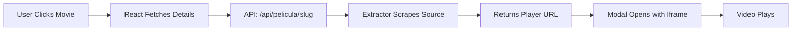

# Quickstart Guide

This guide will take you from zero to watching your first video in under 10 minutes. We'll use Docker for the fastest setup, but local development options are also available.

<Info>
  **Prerequisites**: Docker installed on your system. [Get Docker →](https://docs.docker.com/get-docker/)
</Info>

## Quick Start with Docker

The fastest way to get Web Scrapping Hub running is with Docker:

<Steps>
  <Step title="Clone the Repository">
    Get the source code from GitHub:
    
    ```bash
    git clone https://github.com/UnfairAdventage/Web-Scrapping.git
    cd Web-Scrapping
    ```
  </Step>

  <Step title="Build the Docker Image">
    Build the multi-stage Docker image (this will take a few minutes):
    
    ```bash
    cd docker
    docker build -t peliculas-casaos .
    ```
    
    <Note>
      The build process compiles the React frontend and packages it with the Flask backend in a single container.
    </Note>
  </Step>

  <Step title="Run the Container">
    Start the application container:
    
    ```bash
    docker run -d --name peliculas -p 1234:1234 peliculas-casaos
    ```
    
    <Info>
      The `-d` flag runs the container in detached mode, `-p 1234:1234` maps port 1234 to your host.
    </Info>
  </Step>

  <Step title="Access the Application">
    Open your browser and navigate to:
    
    ```
    http://localhost:1234
    ```
    
    You should see the Web Scrapping Hub homepage with the catalog of movies!
  </Step>
</Steps>

## Watch Your First Video

Now let's browse content and start streaming:

<Steps>
  <Step title="Browse the Catalog">
    The homepage displays the latest movies. Use the navigation to explore different sections:
    
    - **Movies** (`/peliculas`) - Latino movies
    - **Series** (`/series`) - TV series
    - **Anime** (`/animes`) - Anime content
    
    <Tip>
      Use the pagination controls at the bottom to browse through pages: `/page/1`, `/page/2`, etc.
    </Tip>
  </Step>

  <Step title="Search for Content">
    Use the search bar to find specific content:
    
    1. Click the search icon in the navigation bar
    2. Type your search query (e.g., "Spider-Man")
    3. Press Enter or click the search button
    
    The search uses the API endpoint `/api/listado?busqueda=YOUR_QUERY` to fetch results.
  </Step>

  <Step title="Select a Movie or Show">
    Click on any movie poster or title card to view details. The app will navigate to:
    
    - Movies: `/movie/<slug>`
    - Series: `/series/<slug>`
    - Anime: `/anime/<slug>`
    
    You'll see:
    - Full synopsis
    - Genre tags
    - Release date
    - High-quality poster
  </Step>

  <Step title="Start Watching">
    Click the **Watch** or **Play** button. This will:
    
    1. Extract the video player iframe from the source
    2. Open a modal player with the embedded video
    3. Display episode navigation (for series/anime)
    
    <Note>
      For series, you can navigate between episodes and seasons using the controls in the player footer.
    </Note>
  </Step>
</Steps>

## Understanding the Flow

Here's what happens behind the scenes when you watch a video:



<Tabs>
  <Tab title="Frontend Flow">
    1. **User clicks on content** → React Router navigates to detail page
    2. **Detail page loads** → TanStack Query fetches data from API
    3. **User clicks Play** → Modal component opens with player
    4. **Player renders** → Iframe displays video from extracted URL
  </Tab>
  
  <Tab title="Backend Flow">
    1. **API receives request** → Flask route `/api/pelicula/<slug>`
    2. **URL constructed** → Based on section (movies/anime)
    3. **Extractor scrapes** → `extraer_iframe_reproductor()` finds player
    4. **JSON returned** → `{player_url, info, slug}`
  </Tab>
  
  <Tab title="Scraping Flow">
    1. **cloudscraper fetches HTML** → Bypasses Cloudflare protection
    2. **BeautifulSoup parses** → Extracts iframe or video elements
    3. **URL extracted** → Player URL identified and returned
    4. **Client renders** → Iframe embedded in React component
  </Tab>
</Tabs>

## Local Development Setup

Prefer to run the backend and frontend separately for development? Here's how:

<AccordionGroup>
  <Accordion title="Backend Setup" icon="python">
    Run the Flask API server:
    
    ```bash
    # Navigate to backend directory
    cd backend
    
    # Create virtual environment
    python3 -m venv .venv
    source .venv/bin/activate
    
    # Install dependencies
    pip install -r requirements.txt
    
    # Run the Flask server
    python -m backend.app
    ```
    
    The API will be available at `http://localhost:1234`
    
    <CodeGroup>
    ```python requirements.txt
    flask
    flask-cors
    beautifulsoup4
    adblockparser
    cloudscraper
    pytest
    ```
    
    ```python Backend Structure
    backend/
    ├── app.py              # Main Flask application
    ├── config.py           # Configuration and target URLs
    ├── main.py            # Entry point
    ├── requirements.txt   # Python dependencies
    ├── extractors/        # Web scraping modules
    │   ├── generic_extractor.py
    │   ├── serie_extractor.py
    │   └── iframe_extractor.py
    └── utils/             # HTTP client utilities
    ```
    </CodeGroup>
  </Accordion>

  <Accordion title="Frontend Setup" icon="react">
    Run the React development server:
    
    ```bash
    # Navigate to frontend directory
    cd frontend/project
    
    # Install dependencies
    npm install
    
    # Start Vite dev server
    npm run dev
    ```
    
    The frontend will be available at `http://localhost:5173` (or the port Vite assigns)
    
    <Note>
      The frontend expects the backend API to be running on `http://localhost:1234`. CORS is enabled in the Flask app.
    </Note>
    
    <CodeGroup>
    ```json package.json (key dependencies)
    {
      "dependencies": {
        "react": "^18.3.1",
        "react-dom": "^18.3.1",
        "react-router-dom": "^7.6.3",
        "@tanstack/react-query": "^5.83.0",
        "lucide-react": "^0.344.0"
      }
    }
    ```
    
    ```typescript Frontend Structure
    frontend/project/src/
    ├── App.tsx              # Main app component
    ├── main.tsx            # React entry point
    ├── components/         # Reusable components
    │   ├── Layout.tsx
    │   ├── CatalogGrid.tsx
    │   ├── FilterBar.tsx
    │   ├── Pagination.tsx
    │   └── LoadingSpinner.tsx
    ├── pages/              # Route pages
    │   ├── CatalogPage.tsx
    │   ├── MovieDetailPage.tsx
    │   ├── SeriesDetailPage.tsx
    │   ├── AnimeDetailPage.tsx
    │   └── PlayerPage.tsx
    └── hooks/              # Custom React hooks
        ├── api/           # API fetching hooks
        ├── ui/            # UI state hooks
        └── utils/         # Utility hooks
    ```
    </CodeGroup>
  </Accordion>
</AccordionGroup>

## Test the API Directly

You can test the backend API endpoints directly with curl or your browser:

<CodeGroup>
```bash Get Available Sections
curl http://localhost:1234/api/secciones
```

```bash Get Movie Catalog (Page 1)
curl "http://localhost:1234/api/listado?seccion=Películas&pagina=1"
```

```bash Search for Content
curl "http://localhost:1234/api/listado?busqueda=avengers"
```

```bash Get Movie Details
curl http://localhost:1234/api/pelicula/spider-man-no-way-home
```

```bash Get Series Episodes
curl http://localhost:1234/api/serie/breaking-bad
```

```bash Check Version
curl http://localhost:1234/api/version
```
</CodeGroup>

<Info>
  All endpoints return JSON. The application automatically checks for updates from the GitHub repository.
</Info>

## Common URL Patterns

Here are the URL patterns you'll encounter in the application:

| Pattern | Example | Description |
|---------|---------|-------------|
| `/page/:number` | `/page/1`, `/page/2` | Paginated catalog browsing |
| `/peliculas` | `/peliculas` | Movies section |
| `/series` | `/series` | Series section |
| `/movie/:slug` | `/movie/spider-man` | Movie detail page |
| `/series/:slug` | `/series/breaking-bad` | Series detail with episodes |
| `/anime/:slug` | `/anime/naruto` | Anime detail with episodes |
| `/ver/:tipo/:slug` | `/ver/pelicula/spider-man` | Video player modal |

<Tip>
  The application uses React Router for client-side navigation, so page transitions are instant!
</Tip>

## Verify Everything Works

Run through this checklist to ensure your installation is working correctly:

<Steps>
  <Step title="Homepage Loads">
    Visit `http://localhost:1234` - You should see movie posters and a navigation bar
  </Step>
  
  <Step title="Pagination Works">
    Click "Next" or navigate to `/page/2` - New content should load
  </Step>
  
  <Step title="Search Functions">
    Search for "Spider" - Results should appear
  </Step>
  
  <Step title="Detail Pages Load">
    Click any movie - You should see synopsis, poster, and genres
  </Step>
  
  <Step title="Video Player Opens">
    Click "Watch" or "Play" - Modal should open with embedded player
  </Step>
</Steps>

<Warning>
  If the video player doesn't load, check the browser console for errors. Some video sources may require specific settings or may be temporarily unavailable.
</Warning>

## Troubleshooting

<AccordionGroup>
  <Accordion title="Docker container won't start" icon="circle-exclamation">
    **Check logs:**
    ```bash
    docker logs peliculas
    ```
    
    **Common issues:**
    - Port 1234 already in use: Stop other services or change the port mapping
    - Build failed: Ensure Docker has enough memory (at least 2GB)
    - Network issues: Check your internet connection for npm/pip downloads
  </Accordion>

  <Accordion title="No content appears" icon="circle-question">
    **Possible causes:**
    - External source is down or blocked
    - Cloudflare protection updated (check cloudscraper version)
    - Network firewall blocking requests
    
    **Check API response:**
    ```bash
    curl http://localhost:1234/api/listado?seccion=Películas&pagina=1
    ```
    
    If you get an error or empty results, the scraping source may need updating.
  </Accordion>

  <Accordion title="Frontend not connecting to backend" icon="link-slash">
    **For local development:**
    - Ensure Flask is running on port 1234
    - Check CORS is enabled in `app.py`:
      ```python
      from flask_cors import CORS
      CORS(app)
      ```
    - Verify the frontend is making requests to the correct URL
  </Accordion>

  <Accordion title="Video player won't load" icon="play-slash">
    **Debugging steps:**
    1. Check browser console for errors
    2. Verify iframe extractor is working:
       ```bash
       curl "http://localhost:1234/api/iframe_player?url=<MOVIE_URL>"
       ```
    3. Some video sources may be geo-restricted or require additional headers
    4. Check if the external site's HTML structure has changed
  </Accordion>
</AccordionGroup>

## Next Steps

Congratulations! You now have Web Scrapping Hub running. Here's what to explore next:

<CardGroup cols={2}>
  <Card title="Architecture Overview" icon="diagram-project" href="/architecture/overview">
    Understand the system architecture and component interactions
  </Card>
  
  <Card title="API Reference" icon="code" href="/api/overview">
    Explore all available API endpoints
  </Card>
  
  <Card title="Configuration" icon="gear" href="/configuration/backend-config">
    Customize target URLs and scraping sources
  </Card>
  
  <Card title="CasaOS Deployment" icon="server" href="/installation/casaos-deployment">
    Deploy to CasaOS for home server use
  </Card>
</CardGroup>

<Note>
  **Development Mode**: For active development, use the local setup with hot reload enabled for both frontend (Vite) and backend (Flask debug mode).
</Note>

## Getting Help

If you encounter issues:

- Check the [GitHub Issues](https://github.com/UnfairAdventage/Web-Scrapping/issues)
- Review the [Architecture Documentation](/architecture/overview)
- Examine the [API Reference](/api/overview)
- Read the source code - it's well-commented!

<Tip>
  The application version is `1.4.8` and can be checked via the `/api/version` endpoint.
</Tip>
